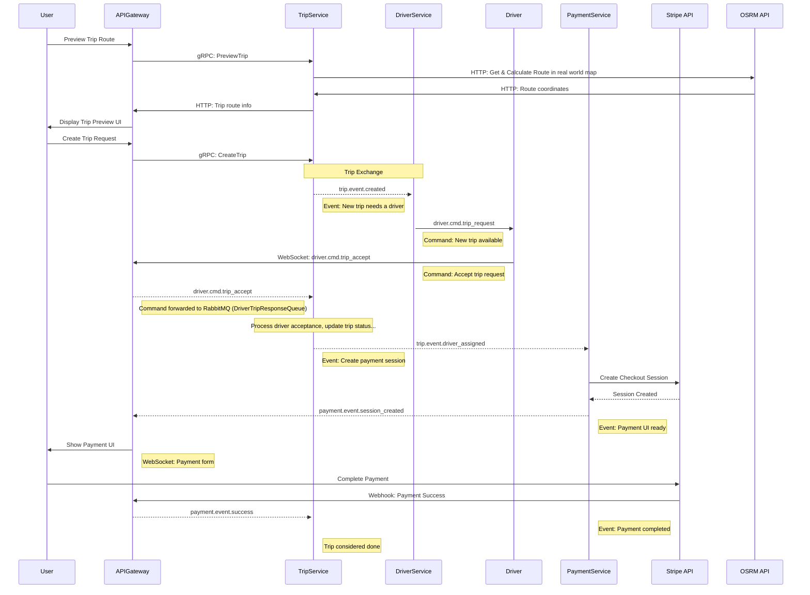

# Distributed Ride Booking Platform (Capstone Project)

## 📌 Project Overview
The platform simulates the core workflows of an Uber-like application, orchestrating multiple microservices to handle trip previews, ride requesting, real-time driver matching, and secure payments. 

### Core Tech Stack:
- **Language:** Go (1.26+)
- **Database:** PostgreSQL (with BSON mapping)
- **Message Broker:** RabbitMQ (for event-driven communication)
- **APIs & Protocols:** HTTP/REST, gRPC, WebSockets (for real-time updates)
- **Telemetry:** OpenTelemetry & Jaeger (Distributed Tracing)
- **Deployment & Orchestration:** Docker, Kubernetes (K8s), and Tilt for local development

---

## 🔄 Trip & Payment Lifecycle (Target Flow)

Here is the event-driven sequence diagram detailing the end-to-end trip creation, driver dispatch, and payment flow:

---
